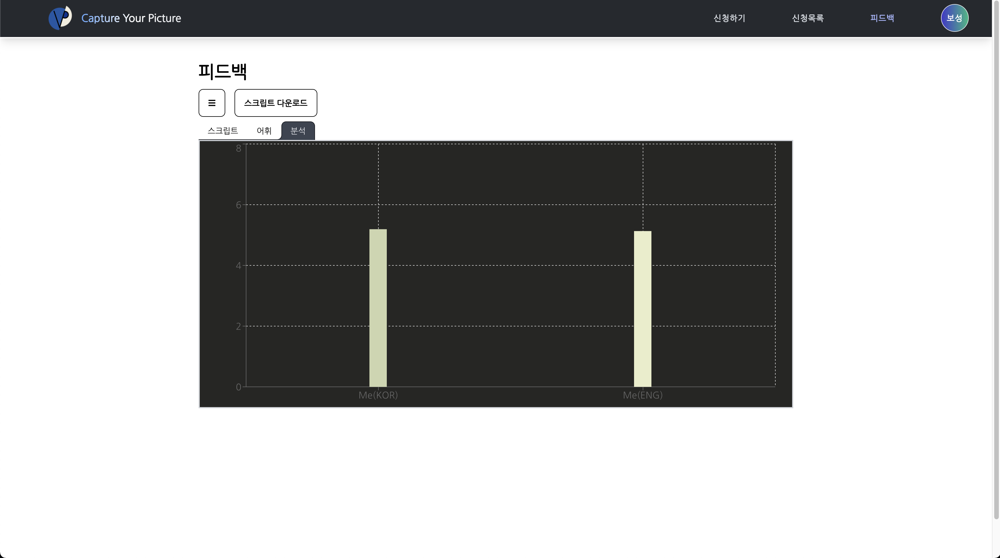

버픽
====

### [프로젝트 설명]
- 버픽은 서로의 언어를 배우고 싶은 유저 간의 매칭을 통해 화상 세션을 진행합니다.
- 화상 세션의 대화 내용을 텍스트로 변환하여 인공지능 모델을 이용해서 유저의 언어학습에 도움이 되는 결과물을 생성합니다.

### [프로젝트 아키텍처]

### [컴포넌트 간 상호작용]

### [담당 역할]
- 백엔드 엔지니어

### [기술스택]
 - Springboot, Mysql, Django, MongoDB, React, Docker, EC2, Jenkins

### [상세구현]
- WebRTC 기능을 이용한 화상 세션기능
- Google STT API를 이용한 음성 인식 기능
- Pororo API를 이용한 언어 처리모델

### [성과 및 결과]
- Oauth2를 이용한 로그인 기능과 JWT 토큰 기반 인증을 구현하였습니다.
- Google cloud SDK를 이용하여 Google STT API를 사용하는 과정을 알 수 있었습니다.
- CI/CD를 구현하는 과정에 대해서 배우게 되었습니다.

### [서비스 화면]
- 토픽 목록 및 스터디 신청

- 예습하기

- 세션 진행

- 피드백(대화 스크립트)

- 피드백(어휘 분석)

- 피드백(대화 속도)

